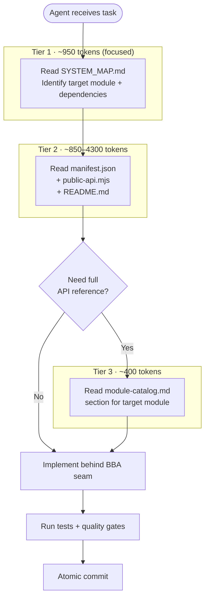
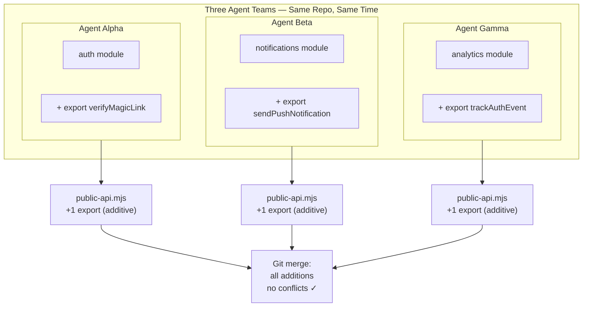
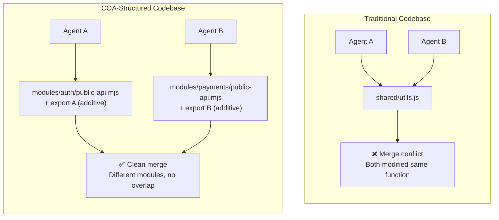
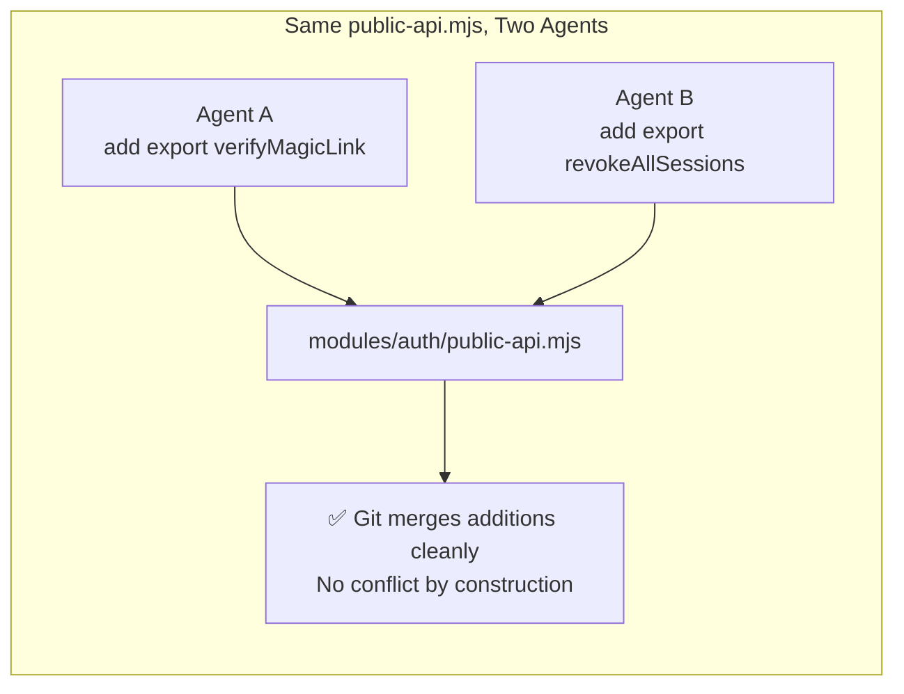

<!-- @HEADER
@version 0.7.50 | 2026-05-03
@purpose Visual architecture diagrams for COA pipeline, agent navigation, and parallel safety — renderable on GitHub via Mermaid.
@sidecar coa-architecture-diagram.md.header.md
@layer docs | @hex _none_ | @ctx _none_
@public true
@edit careful -->

# COA Architecture Diagrams

Three views of Context-Optimized Architecture, each answering a different question.

---

## 1. The Pipeline: Raw Codebase → Agent Execution

How unstructured code becomes navigable by AI agents.

```mermaid
graph LR
    subgraph RAW["① Raw Codebase"]
        direction TB
        R1["38 hex modules"]
        R2["domain / ports / adapters"]
        R3["public-api.mjs barrels"]
    end

    subgraph META["② Metadata Layer"]
        direction TB
        M1["Structured file headers"]
        M2["manifest.json per module<br/>(capabilities, dependencies,<br/>structure)"]
        M3["SYSTEM_MAP.md<br/>(~1900 tok, ~950 focused)"]
        M4["dependency-graph.json"]
    end

    subgraph LOAD["③ Bounded Context Loading"]
        direction TB
        L1["Tier 1: System Map<br/>~950 tok focused — always first"]
        L2["Tier 2: Module meta<br/>~850–4300 tok — target only"]
        L3["Tier 3: Full reference<br/>~400 tok — on demand"]
    end

    subgraph EXEC["④ Agent Execution"]
        direction TB
        E1["16K token budget"]
        E2["One module per agent"]
        E3["BBA seams for isolation"]
    end

    RAW --> META --> LOAD --> EXEC
```



---

## 2. Agent Navigation: Tiered Loading Protocol

How a single agent finds and modifies code within a bounded token budget.



**Typical token budget (mid-sized module):**

```
System prompt + rules        ~400 tok
Tier 1 (SYSTEM_MAP, focused)  ~950 tok
Tier 2 (module metadata)    ~1800 tok  (median)
File being edited           ~1500 tok
Reasoning + output          ~1100 tok
─────────────────────────────────────
Total                       ~6180 tok
```

---

## 3. Parallel Safety: Multiple Agents, Zero Collisions

How hex boundaries + BBA make concurrent agent work safe by construction.



**Defense layers that make this work:**

```
Hex module boundaries        → agents can't touch other modules' internals
public-api.mjs barrels       → cross-module access through exports only
BBA seams                    → changes are additions, not modifications
Atomic slices + fast commits → short conflict windows
Structured headers           → agents understand file intent without reading source
Claims protocol              → optional coordination for rare modify-in-place cases
```

---

## 4. Before / After: Traditional vs COA



**Even when agents touch the same file:**



---

## Usage

Reference individual diagrams from other documents:

- **README.md** → Diagram 1 (pipeline overview) or Diagram 4 (before/after)
- **Whitepaper** → Diagram 2 (tiered loading) for §6.4
- **Flagship essay** → Diagram 3 (parallel safety) or Diagram 4 (before/after)
- **Conference deck** → All four, one per slide
